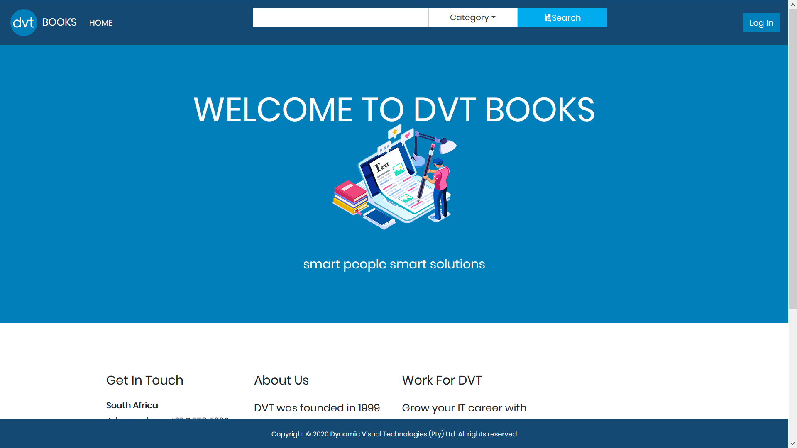
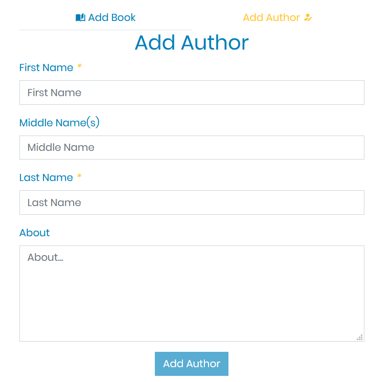
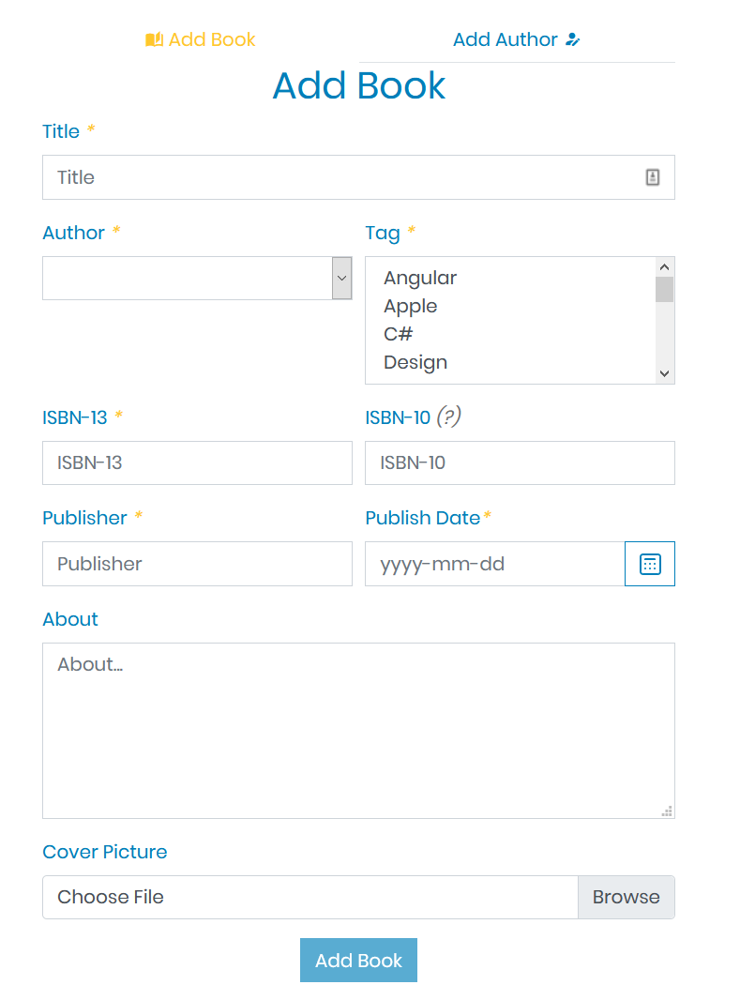
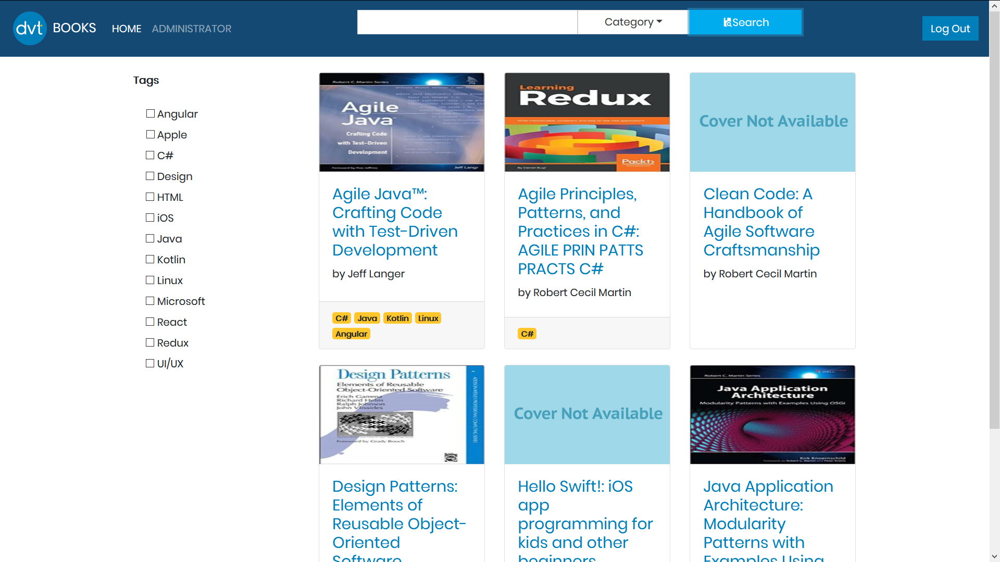
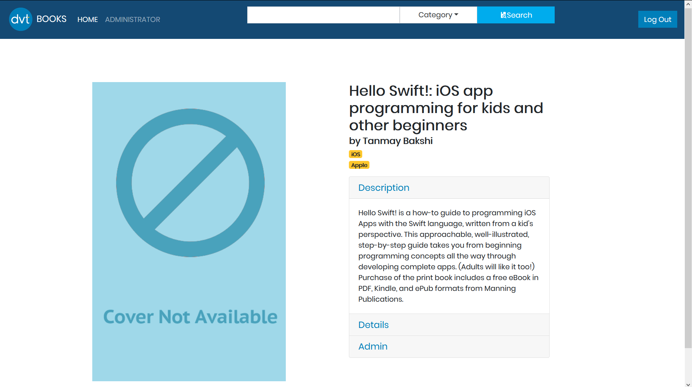

# DVTBooks

DVT is in the process of building a central repository for its developers to find software development books. The application has been named DVTBooks. A group of backend developers have created the APIs and databases to create, read, update and delete books.

They now require your help to provide this functionality to users. Using Angular 2+, you have been tasked to build a web application front-end for DVTBooks.

The DVTBooks API endpoints are secured with OAuth,users will have to present a JWT when making requests.Users can acquire access tokens from an identity server that the backend developers have provisioned. The Angular application can do this through OAuth2.0 implicit flow.

The application will allow users with the Administrator role to create, read,search,update and delete books. Users with the User role can only read and search for books.

Some users maybe using a mobile phone, tablet or desktop computer and some users may even prefer another language, such as isiZulu or Afrikaans it is important that you take these factors into consideration while building your application.

For consistency with other DVT applications, the web application needs to follow the company’s corporate guideline. This guideline will be provided to you.

## Project Requirements and Extensions
1. The project should use Angular 2+.
2. The project should be fully responsive on desktop, mobile and other device browsers.
3. The project should implement Internationalization (i18n) to support English, Afrikaans, isiZulu. 
4. The project should follow corporate guidelines.  
5. The project should be a progressive web application (PWA). 
6. The project building, testing, and deployment should be handled by a CI/CD Pipeline (Circle CI). 
7. The project should have a code coverage of at least 80% on functions, statements, branches and lines.

### User Roles
    * All Users can search for books and view them.
    * Administrators can create, read, search and update books and authors.
    
### Requirements
* Docker Images to run the application
    * str1zzwald/dvt-books-api:1.0.3
    * mcr.microsoft.com/mssql/server:2017-latest

# Preview Images

# Outcomes
1. ~~Practiced building components and services~~
2. ~~Practiced authentication using OAuth & OpenID Connect (OIDC)~~
3. ~~Practiced consuming REST APIs~~
4. ~~Used server-side filtering~~
5. ~~Practiced formatting field values~~
6. ~~Practiced input validation~~
7. ~~Implemented unit tests using Karma & Jasmine~~
8. ~~Used Internationalization (i18n)~~
9. ~~Practiced Reactive Programming using Rx and Observables~~
10. ~~Used server-side pagination~~
11. ~~Loaded data & assets from cache when offline (PWA)~~
12. ~~Practiced using Docker in an Angular web application13. Built a modern app using a web framework that calls a secure back-end service~~

API https://github.com/DVT/dvt-books
